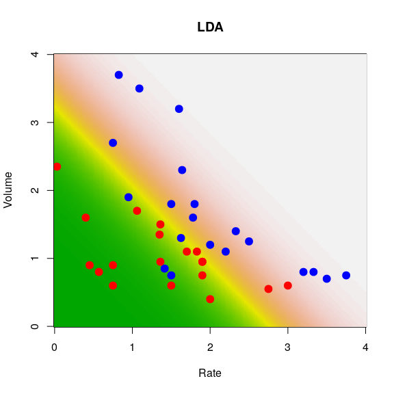
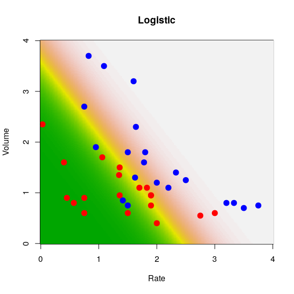

STAT406 - Lecture 13 notes
================
Matias Salibian-Barrera
2018-10-23

LICENSE
-------

These notes are released under the "Creative Commons Attribution-ShareAlike 4.0 International" license. See the **human-readable version** [here](https://creativecommons.org/licenses/by-sa/4.0/) and the **real thing** [here](https://creativecommons.org/licenses/by-sa/4.0/legalcode).

Lecture slides
--------------

Preliminary lecture slides are [here](STAT406-18-lecture-13-preliminary.pdf).

Classification
==============

As we discussed in class, what is commonly referred to as *classification* can be thought of as prediction, when the responses are classes and we use a particular loss function (the *0-1 loss* we discussed in class). Furthermore, it is easy to show (which we did in class) that the optimal classifier (in terms of minimizing the expected misclassification error) is the one that assigns an observation to the class with the highest probability of occuring, conditional to the value of the observed explanatory variables.

<!-- A related discussion about including costs of misclassification  -->
<!-- and the difference between prediction and classification can be found here: [http://www.fharrell.com/post/classification/](http://www.fharrell.com/post/classification/). -->
Most (if not all) classification methods we will cover in this course can be simply thought of as different approaches to estimate the conditional probability of each class, conditional on the value of the explanatory variables. In symbols: *P*(**G** = **g**|**X** = **x**<sub>0</sub>). The obvious parallel with what we have done before in this class, is that many (all?) regression methods we discussed in class are different ways of estimating the conditional mean of the response variable (conditional on the value of the explanatory variables).

As in the regression case, there are different ways to estimate this optimal predictor / classifier. Some will be model-based, some will be non-parametric in nature. And some can be considered "restricted" non-parametric methods (without relying on a model, but imposing some other type of constrain on the shape of the classifier). The equivalent methods for regression with continuous responses are: linear or non-linear regression as model-based methods; kernel or local regression as non-parametric methods; and splines or regression trees as "constrained" (regularized?) non-parametric methods.

Below we first discuss model-based methods (Linear and Quadratic Discriminant Analysis) and later introduce non-parametric methods (nearest-neighbours and classification trees).

Linear Discriminant Analysis
----------------------------

Probably the "second easiest to explain" approach (what would "*the* easiest to explain" be?) to estimate the above probability is to model the distribution of the explanatory variables *within* each class. This will then uniquely determine the probabilities we need to estimate, as discussed above and in class. In particular, one the simplest models we can use is a normal (Gaussian) one. As we saw in class, if we assume that the distribution of the features for each class is Gaussian with a common covariance matrix across clases, then it easy to show (*and I strongly suggest that you do it*) that the optimal classifier (using the 0-1 loss function mentioned above) is a linear function of the explanatory variables. The coefficients of this linear function depend on the parameters of the assumed Gaussian distributions. The latter can be estimated using the training set and plugging them in provides a natural estimator of the optimal classifier.

The function `lda` in the `MASS` library implements this simple classifier. We illustrate it here on the rather simple and well-known vaso constriction data, available in the `robustbase` package. More details, as usual, can be found on its help page. The response variable takes two values (represented below as **blue** and **red**), and there are only two explanatory variables (which allows us to visualize our methods and results).

``` r
data(vaso, package='robustbase')
plot(Volume ~ Rate, data=vaso, pch=19, cex=1.5, 
       col=c('red', 'blue')[Y+1])
```


To train the LDA classifier we use the function `lda` as follows (note the *model-like* syntax to indicate the response and explanatory variables):

``` r
library(MASS)
a.lda <- lda(Y ~ Volume + Rate, data=vaso)
```

Now, given any value of the explanatory variables `(Volume, Rate)` we can use the method `predict` on the object returned by `lda()` to estimate the conditional probabilities of **blue** and **red**. Next we visualize which regions of the feature space will be predicted to contain **blue** points (and then obviously which areas will be predicted to correspond to **red** responses). To do this we build a relatively fine grid of posible `(Volume, Rate)` values and plot the corresponding predictions for one class (i.e. the conditional probabilites for that class as a function of the explanatory variables):

``` r
# build a grid of points of (Volume, Rate),
# and obtain predictions for each of them
# 40,000 in total
xvol <- seq(0, 4, length=200)
xrat <- seq(0, 4, length=200)
xx <- expand.grid(xvol, xrat)
names(xx) <- c('Volume', 'Rate')

pr.lda <- predict(a.lda, newdata=xx)$posterior[,2]
image(xrat, xvol, matrix(pr.lda, 200, 200), col=terrain.colors(100),
      ylab='Volume', xlab='Rate', main='LDA')
points(Volume ~ Rate, data=vaso, pch=19, cex=1.5,
       col=c('red', 'blue')[Y+1])
```



On the plot above larger numbers are shown with lighther colors (dark green corresponds to very low values).

This model-based approach to classification (LDA) is optimal if the model is correct. The strongest assumption of this model is, of course, the Gaussian distribution of the vector of explanatory variables. The second strongest assumption is that of equal "shape" (covariance matrix) for the distribution of the explanatory variables across the different groups in the population. This latter assumption can be relaxed slightly if we assume instead that the features have a Gaussian distribution within each class, but that the covariance matrix may be different across classes. The corresponding optimal classifier is now a quadratic function of the predictors (**prove it!**). The function `qda` in the `MASS` library implements this classifier, and it can be used just like `lda` (as usual, refer to its help page for details).

This approach can be used with any number of classes. Any limitations?

Logistic regression (Review)
----------------------------

If we model the distribution of the features within each class using a multivariate Gaussian distribution, then it is easy to see that the boundaries between classes are linear (functions of the features) (*check!*) Furthermore, the log of the odds ratio between classes is a linear function. It is interesting to note that one can start with this last assumption (instead of the full Gaussian model) and arrive at a fully parametric model for the conditional distibution of the classes given the features (see the class slides). The parameters can be estimated using maximum likelihood. For two classes this is the logistic regression model, which you may have seen in previous courses.

We illustrate this on the `vaso` data as before. Since this is a 2-class problem, we just need to fit a logistic regression model. The function `glm` in `R` does it for us, we specify that we want to fit such a model using the argument `family=binomial`. Once we obtain parameter estimators (in the `glm` object `a` below), we use the `predict` method to obtain predicted conditional probabilities on the same grid we used before:

``` r
a <- glm(Y ~ ., data=vaso, family=binomial)
pr <- predict(a, newdata=xx, type='response')
```

We now plot the data and the *surface* of predicted probabilities for blue points (higher probabilites are displayed with lighter colors).

``` r
image(xrat, xvol, matrix(pr, 200, 200), col=terrain.colors(100),
      ylab='Volume', xlab='Rate', main='Logistic')
points(Volume ~ Rate, data=vaso, pch=19, cex=1.5,
       col=c('red', 'blue')[Y+1])
```


