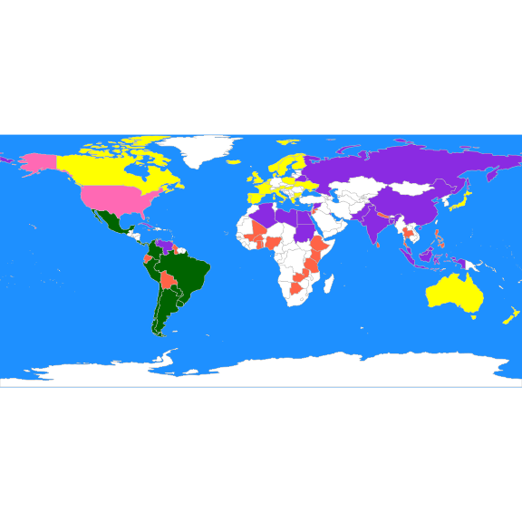
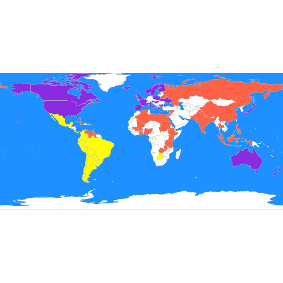
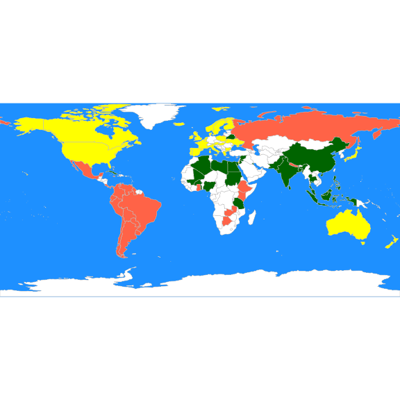
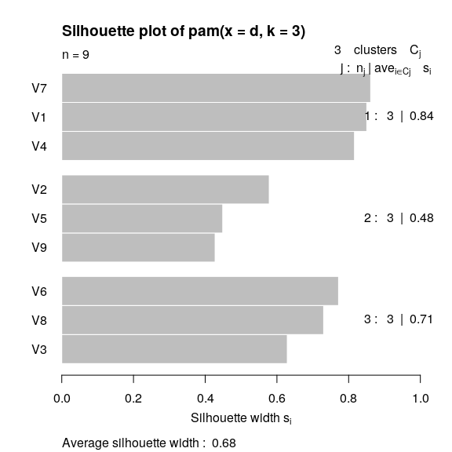

STAT406 - Lecture 19 notes
================
Matias Salibian-Barrera
2018-11-16

LICENSE
-------

These notes are released under the "Creative Commons Attribution-ShareAlike 4.0 International" license. See the **human-readable version** [here](https://creativecommons.org/licenses/by-sa/4.0/) and the **real thing** [here](https://creativecommons.org/licenses/by-sa/4.0/legalcode).

Lecture slides
--------------

Preliminary lecture slides are [here](STAT406-18-lecture-19-preliminary.pdf).

Unsupervised learning
=====================

Unsupervised learning methods differ from the supervised ones we have studied so far in that there is no response variable. The objective is not related to prediction but rather to the identification of different possible structures that may be present in the data. For example, one may be interested in determining whether the observations are "grouped" in some way (clustering), or if the data can be efficiently represented using fewer variables or features (dimension reduction).

Many of these methods do not rely on any probabilistic model, and thus there may not be a clear *target* to be estimated or approximated. As a consequence, the conclusions that can be reached from this type of analyses are often of an exploratory nature.

Clustering
----------

A large class of unsupervised learning methods is collectively called *clustering*. The objective can be described as identifying different groups of observations that are closer to each other ("clustered") than to those of the other groups. The data consist of *n* observations *X*<sub>1</sub>, *X*<sub>2</sub>, ..., *X*<sub>*n*</sub>, each with *p* features. In general, the number of groups is unknown and needs to be determined from the data.

In this course we will discuss both model-free and model-based clustering methods. In the first group we will present K-means (and other related methods), and hierarchical (agglomerative) clustering methods. Model-based clustering is based on the assumption that the data is a random sample, and that the distribution of the vector of features **X** is a combination of different distributions (technically: a *mixture model*). In the latter case, for observations belonging to a group, the vector **X** is assumed to have a distribution in a specific (generally parametric) family. Some of these model-based methods treat the group labels as missing (unobserved) responses, and rely on the assumed model to infer those missing labels.

### K-means, K-means++, K-medoids

Probably the most intuitive and easier to explain unsupervised clustering algorithm is K-means (and its variants *K-means++* and K-medoids, a.k.a. *pam*, partition around medoids). The specifics of the K-means algorithm were discussed in class. Here we will illustrate its use on a few examples.

#### UN votes example.

These data contain the historical voting patterns of United Nations members. More details can be found here:

> Voeten, Erik; Strezhnev, Anton; Bailey, Michael, 2009, "United Nations General Assembly Voting Data", <http://hdl.handle.net/1902.1/12379>, Harvard Dataverse, V11

The UN was founded in 1946 and it contains 193 member states. The data include only "important" votes, as classified by the U.S. State Department. The votes for each country were coded as follows: Yes (1), Abstain (2), No (3), Absent (8), Not a Member (9). There were 368 important votes, and 77 countries voted in at least 95% of these. We focus on these UN members. Our goal is to explore whether voting patterns reflect political alignments, and also whether countries vote along known political blocks. Our data consists of 77 observations with 368 variables each. More information on these data can be found [here](https://dataverse.harvard.edu/dataset.xhtml?persistentId=hdl:1902.1/12379).

The dataset is organized by vote (resolution), one per row, and its columns contain the corresponding vote of each country (one country per column). We first read the data, and limit ourselves to resolutions where every country voted without missing votes:

``` r
X <- read.table(file='unvotes.csv', sep=',', row.names=1, header=TRUE)
X2 <- X[complete.cases(X),]
```

We now compute a K-means partition using the function `kmeans` with *K = 5*, and look at the resulting groups:

``` r
set.seed(123)
b <- kmeans(t(X2), centers=5, iter.max=20, nstart=1)
table(b$cluster)
```

    ## 
    ##  1  2  3  4  5 
    ## 18  2  7 19 31

If we run `kmeans` again, we might get a different partition:

``` r
b <- kmeans(t(X2), centers=5, iter.max=20, nstart=1)
table(b$cluster)
```

    ## 
    ##  1  2  3  4  5 
    ## 27 12 13  7 18

It is better to consider a large number of random starts and take the **best** found solution (what does *best* mean in this context? in other words, how does the algorithm decide which one is the solution it should return?)

``` r
# Take the best solution out of 1000 random starts
b <- kmeans(t(X2), centers = 5, iter.max = 20, nstart = 1000)
split(colnames(X2), b$cluster)
```

    ## $`1`
    ##  [1] "Argentina"  "Bahamas"    "Brazil"     "Chile"      "Colombia"  
    ##  [6] "Costa.Rica" "Mexico"     "Panama"     "Paraguay"   "Peru"      
    ## [11] "Uruguay"   
    ## 
    ## $`2`
    ## [1] "Israel" "USA"   
    ## 
    ## $`3`
    ##  [1] "Bolivia"             "Botswana"            "Burkina.Faso"       
    ##  [4] "Ecuador"             "Ethiopia"            "Ghana"              
    ##  [7] "Guyana"              "Jamaica"             "Jordan"             
    ## [10] "Kenya"               "Mali"                "Nepal"              
    ## [13] "Nigeria"             "Philippines"         "Singapore"          
    ## [16] "Sri.Lanka"           "Tanzania"            "Thailand"           
    ## [19] "Togo"                "Trinidad.and.Tobago" "Zambia"             
    ## 
    ## $`4`
    ##  [1] "Algeria"              "Bangladesh"           "Belarus"             
    ##  [4] "Brunei.Darussalam"    "China"                "Cuba"                
    ##  [7] "Egypt"                "India"                "Indonesia"           
    ## [10] "Kuwait"               "Libya"                "Malaysia"            
    ## [13] "Pakistan"             "Russian.Federation"   "Sudan"               
    ## [16] "Syrian.Arab.Republic" "Venezuela"           
    ## 
    ## $`5`
    ##  [1] "Australia"   "Austria"     "Belgium"     "Bulgaria"    "Canada"     
    ##  [6] "Cyprus"      "Denmark"     "Finland"     "France"      "Greece"     
    ## [11] "Hungary"     "Iceland"     "Ireland"     "Italy"       "Japan"      
    ## [16] "Luxembourg"  "Malta"       "Netherlands" "New.Zealand" "Norway"     
    ## [21] "Poland"      "Portugal"    "Spain"       "Sweden"      "UK"         
    ## [26] "Ukraine"

It may be better to look at the groups on a map:

``` r
library(rworldmap)
library(countrycode)
these <- countrycode(colnames(X2), "country.name", "iso3c")
malDF <- data.frame(country = these, cluster = b$cluster)
# malDF is a data.frame with the ISO3 country names plus a variable to merge
# to the map data

# This line will join your malDF data.frame to the country map data
malMap <- joinCountryData2Map(malDF, joinCode = "ISO3", nameJoinColumn = "country")
```

    ## 77 codes from your data successfully matched countries in the map
    ## 0 codes from your data failed to match with a country code in the map
    ## 166 codes from the map weren't represented in your data

``` r
# colors()[grep('blue', colors())] fill the space on the graphical device
par(mai = c(0, 0, 0, 0), xaxs = "i", yaxs = "i")
mapCountryData(malMap, nameColumnToPlot = "cluster", catMethod = "categorical", 
    missingCountryCol = "white", addLegend = FALSE, mapTitle = "", colourPalette = c("darkgreen", 
        "hotpink", "tomato", "blueviolet", "yellow"), oceanCol = "dodgerblue")
```



We can compare this partition with the one we obtain using PAM (K-medoids), which is implemented in the function `pam` of the package `cluster`. Recall from the discussion in class that `pam` does not need to manipulate the actual observations, only its pairwise distances (or dissimilarities). In this case we use Euclidean distances, but it may be interesting to explore other distances, particulary in light of the categorical nature of the data. Furthermore, to obtain clusters that may be easier to interpret we use `K = 3`:

``` r
library(cluster)
# Use Euclidean distances
d <- dist(t(X))
# what happens with missing values?
set.seed(123)
a <- pam(d, k = 3)
```

Compare the resulting groups with those of *K-means*:

``` r
b <- kmeans(t(X2), centers = 3, iter.max = 20, nstart = 1000)
table(a$clustering)
```

    ## 
    ##  1  2  3 
    ## 26 24 27

``` r
table(b$cluster)
```

    ## 
    ##  1  2  3 
    ## 16 33 28

An better visualization is done using the map. interesting We plot the 3 groups found by `pam` on the map, followed by those found by K-means:

``` r
these <- countrycode(colnames(X), "country.name", "iso3c")
malDF <- data.frame(country = these, cluster = a$clustering)
malMap <- joinCountryData2Map(malDF, joinCode = "ISO3", nameJoinColumn = "country")
```

    ## 77 codes from your data successfully matched countries in the map
    ## 0 codes from your data failed to match with a country code in the map
    ## 166 codes from the map weren't represented in your data

``` r
par(mai = c(0, 0, 0, 0), xaxs = "i", yaxs = "i")
mapCountryData(malMap, nameColumnToPlot = "cluster", catMethod = "categorical", 
    missingCountryCol = "white", addLegend = FALSE, mapTitle = "", colourPalette = c("darkgreen", 
        "hotpink", "tomato", "blueviolet", "yellow"), oceanCol = "dodgerblue")
```


``` r
these <- countrycode(colnames(X2), "country.name", "iso3c")
malDF <- data.frame(country = these, cluster = b$cluster)
malMap <- joinCountryData2Map(malDF, joinCode = "ISO3", nameJoinColumn = "country")
```

    ## 77 codes from your data successfully matched countries in the map
    ## 0 codes from your data failed to match with a country code in the map
    ## 166 codes from the map weren't represented in your data

``` r
par(mai = c(0, 0, 0, 0), xaxs = "i", yaxs = "i")
mapCountryData(malMap, nameColumnToPlot = "cluster", catMethod = "categorical", 
    missingCountryCol = "white", addLegend = FALSE, mapTitle = "", colourPalette = c("yellow", 
        "tomato", "blueviolet"), oceanCol = "dodgerblue")
```



What if we use the L\_1 norm instead?

``` r
d <- dist(t(X), method = "manhattan")
set.seed(123)
a <- pam(d, k = 3)
these <- countrycode(colnames(X), "country.name", "iso3c")
malDF <- data.frame(country = these, cluster = a$clustering)
malMap <- joinCountryData2Map(malDF, joinCode = "ISO3", nameJoinColumn = "country")
```

    ## 77 codes from your data successfully matched countries in the map
    ## 0 codes from your data failed to match with a country code in the map
    ## 166 codes from the map weren't represented in your data

``` r
par(mai = c(0, 0, 0, 0), xaxs = "i", yaxs = "i")
mapCountryData(malMap, nameColumnToPlot = "cluster", catMethod = "categorical", 
    missingCountryCol = "white", addLegend = FALSE, mapTitle = "", colourPalette = c("darkgreen", 
        "hotpink", "tomato", "blueviolet", "yellow"), oceanCol = "dodgerblue")
```



As mentioned before, since the data set does not include a *true label*, the comparison between the different results is somewhat subjective, and it often relies on the knowledge of the subject matter experts. In our example above, this would mean asking the opinion of a political scientist as to whether these groupings correspond to known international political blocks or alignments.

#### Breweries

In this example beer drinkers were asked to rate 9 breweries one 26 attributes, e.g. whether this brewery has a rich tradition; or whether it makes very good pilsner beer, etc. For each of these questions, the *judges* reported a score on a 6-point scale ranging from 1: "not true at all" to 6: "very true". The data are in the file `breweries.dat`:

``` r
x <- read.table('breweries.dat', header=FALSE)
x <- t(x)
```

For illustration purposes we use the *L*<sub>1</sub> distance and the PAM clustering method.

``` r
d <- dist(x, method='manhattan')
set.seed(123)
a <- pam(d, k=3)
table(a$clustering)
```

    ## 
    ## 1 2 3 
    ## 3 3 3

To visualize the strength of these cluster partition we use the silhouette plot discussed in class:

``` r
plot(a)
```



Since other distances may produce different partitions, an interesting exercise would be to compare the above clusters with those found using the Euclidean or *L*<sub>∞</sub> norms, for example.

#### Cancer example

This data contains gene expression levels for 6830 genes (rows) for 64 cell samples (columns). More information can be found here: <http://genome-www.stanford.edu/nci60/>. The data are included in the `ElemStatLearn` package, and also available on-line: <https://web.stanford.edu/~hastie/ElemStatLearn/>.

We will use K-means to identify 8 possible clusters among the 64 cell samples. As discussed in class this exercise can (perhaps more interestingly) be formulated in terms of *feature selection*. We load the data and use K-means to find 8 clusters:

``` r
data(nci, package = "ElemStatLearn")
ncit <- t(nci)
set.seed(31)
a <- kmeans(ncit, centers = 8, iter.max = 5000, nstart = 100)
table(a$cluster)
```

    ## 
    ##  1  2  3  4  5  6  7  8 
    ##  3  8  5 14  6 15  9  4

Note that in this application we do know the group to which each observation belongs (its cancer type). We can look at the cancer types that have been grouped together in each of the 8 clusters:

``` r
sapply(split(colnames(nci), a$cluster), table)
```

    ## $`1`
    ## 
    ## K562A-repro K562B-repro    LEUKEMIA 
    ##           1           1           1 
    ## 
    ## $`2`
    ## 
    ## BREAST    CNS  RENAL 
    ##      2      5      1 
    ## 
    ## $`3`
    ## 
    ## LEUKEMIA 
    ##        5 
    ## 
    ## $`4`
    ## 
    ##    COLON    NSCLC  OVARIAN PROSTATE 
    ##        1        6        5        2 
    ## 
    ## $`5`
    ## 
    ## COLON 
    ##     6 
    ## 
    ## $`6`
    ## 
    ##   BREAST MELANOMA    NSCLC  OVARIAN    RENAL  UNKNOWN 
    ##        1        1        3        1        8        1 
    ## 
    ## $`7`
    ## 
    ##   BREAST MELANOMA 
    ##        2        7 
    ## 
    ## $`8`
    ## 
    ##      BREAST MCF7A-repro MCF7D-repro 
    ##           2           1           1

Note that clusters 2, 3, 5, 6 and 7 are dominated by one type of cancer. Similarly, almost all melanoma and renal samples are in clusters 7 and 6, respectively, while all CNS samples are in cluster 2. Cluster 4 is harder to interpret. Although all ovarian cancer samples are in this cluster, it also contains 2/3 of the NSCLC samples. It may be of interest to compare these results with those using different numbers of clusters.

Finally, we will compare this partition (obtained with the usual K-means algorithm started from `100` random initial configurations) with the one found by K++ as implemented in `flexclust::kcca`:

``` r
library(flexclust)
set.seed(123)
kpp <- kcca(ncit, k = 8, family = kccaFamily("kmeans"), control = list(initcent = "kmeanspp"))
table(kpp@cluster)
```

    ## 
    ##  1  2  3  4  5  6  7  8 
    ##  2  3  1 18 13  3 16  8

while the one obtained with `kmeans` was

``` r
table(a$cluster)
```

    ## 
    ##  1  2  3  4  5  6  7  8 
    ##  3  8  5 14  6 15  9  4

Note that the two partitions are quite different. Furthermore, note that there is still a lot of randomness in the solution returned by K++. If we run it again with a different pseudo-random number generating seed we obtain a very different partition:

``` r
set.seed(987)
table(kcca(ncit, k = 8, family = kccaFamily("kmeans"), control = list(initcent = "kmeanspp"))@cluster)
```

    ## 
    ##  1  2  3  4  5  6  7  8 
    ## 28 14  2  9  6  2  2  1

A very good exercise would be to determine which of these different partitions is better in terms of the objective function being optimized to find the clusters.
