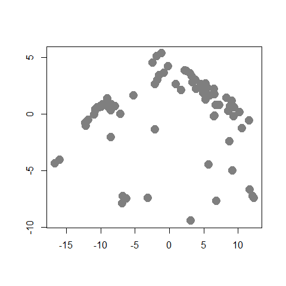
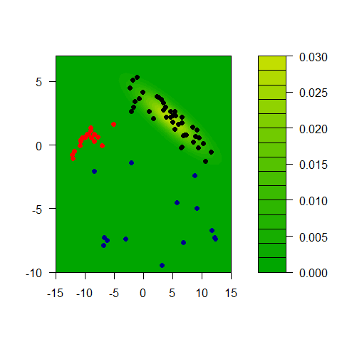
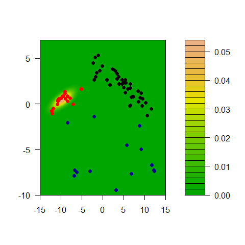
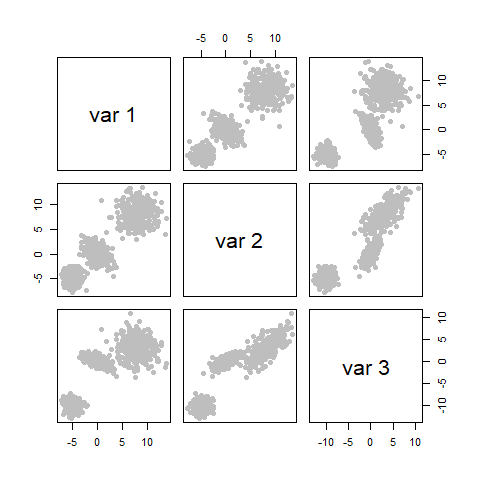
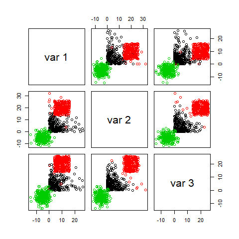
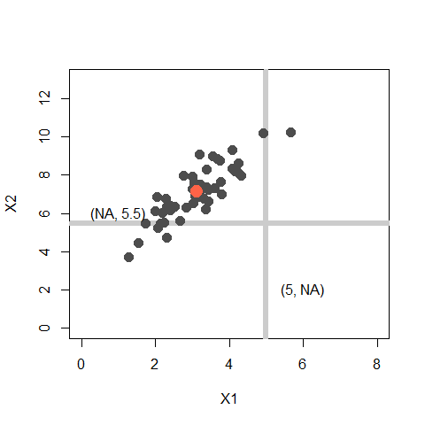
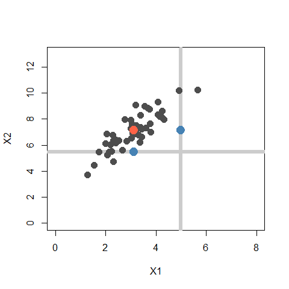
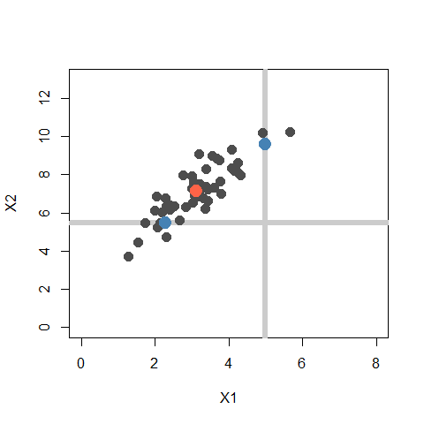

STAT406 - Lecture 20 notes
================
Matias Salibian-Barrera
2018-11-22

LICENSE
-------

These notes are released under the "Creative Commons Attribution-ShareAlike 4.0 International" license. See the **human-readable version** [here](https://creativecommons.org/licenses/by-sa/4.0/) and the **real thing** [here](https://creativecommons.org/licenses/by-sa/4.0/legalcode).

Lecture slides
--------------

Lecture slides are [here](STAT406-18-lecture-20.pdf).

Model based clustering
----------------------

Model-based clustering methods depend on a probabilistic model that specifies the distribution of the observed features (over the whole population). This distribution is typically modelled as a mixture of several different distributions. Given a sample of *n* vectors of features *X*<sub>1</sub>, *X*<sub>2</sub>, ..., *X*<sub>*n*</sub>, the clustering problem then becomes the estimation of the *n* unobserved labels that indicate to which sub-population (cluster, group) each *X*<sub>*i*</sub> belongs. In addition, one generally also has to estimate the parameters that specify the distribution of *X* in each assumed group.

Given that this method is based on a full specificification of the distribution of the observed vector of features, it is not surprising that the parameters are generally estimated using maximum likelihood. The difficulty is that there are *n* unobserved (missing) variables (the group labels) that also need to be estimated (*imputed*). The most commonly used approach uses the EM algorithm to perform maximum likelihood estimation with missing observations.

EM algorithm
------------

The specifics of the EM algorithm were introduced and discussed in class. Although the algorithm may seem clear at first sight, it is fairly subtle, and mistakes and misunderstandings are very (**very**) common. Many applications of the EM algorithm found on-line are either wrong, or wrongly derived. For a more detailed discussion and a different (and also very useful) application of the algorithm, see the Section **Imputation via EM** below.

Bivariate Gaussian mixture model via EM "by hand"
-------------------------------------------------

We will use a 2-dimensional representation of the UN votes data. This lower-dimensional representation is obtained using multidimensional scaling, a topic we will cover later in the course. For formulas and specific steps of the algorithm please refer to your class notes. We first load the data and reduce it to a 2-dimensional problem, in order to be able to plot the results. It will be a very nice exercise for the reader to re-do this analysis on the original data set.

``` r
X <- read.table(file='../Lecture19/unvotes.csv', sep=',', row.names=1, header=TRUE)
# Compute pairwise distances and use MDS
dd <- dist(t(X))
tmp <- cmdscale(dd, k = 2)
```

This is the data with which we will work:



We will now use the EM algorithm to find (Gaussian-ly distributed) clusters in the data. First we find initial maximum likelihood estimators (i.e. initial values for the EM algorithm), using a random partition of the data:

``` r
k <- 3
n <- nrow(tmp)
set.seed(123456)
b <- sample( (1:n) %% k + 1 )
gammas <- matrix(0, n, k)
for(j in 1:k) gammas[b==j, j] <- 1
pis <- colSums(gammas) / n
mus <- sigmas <- vector('list', k)
for(j in 1:k) {
  mus[[j]] <- colSums( tmp * gammas[, j] ) / sum(gammas[, j])
  sigmas[[j]] <- t(tmp * gammas[, j]) %*% tmp / sum(gammas[, j])
}
```

Note that the above loop could have been computed more efficiently using the fact that at the initial step the gamma coefficients are either 0's or 1's. However, in the following steps of the EM algorithm we will need to use such *weighted averages* computations, since in general the weights are between 0 and 1.

This is the initial configuration (pure noise):


We now launch our iterations. Here I run 120 iterations. Can you think of an appropriate convergence criterion? Should we look at the parameter estimates, the gammas (posterior class probabilities), the likelihood function?

``` r
library(mvtnorm)
niter <- 120
for(i in 1:niter) {
  # E step
  # compute posterior probabilites f(x_i, \theta^k)
  for(j in 1:k) gammas[,j] <- apply(tmp, 1, dmvnorm, mean=mus[[j]], sigma=sigmas[[j]])
  # multiply by probs of each class
  # f(x_i, \theta^k) * pi_k
  gammas <- gammas %*% diag(pis)
  # standardize: f(x_i, \theta^k) * pi_k / [ sum_s { f(x_i, \theta^s) * pi_s } ]
  gammas <- gammas / rowSums(gammas)
  # M step
  # the maximizers of the expected likelihood have
  # a closed form in the Gaussian case, they are 
  # just weighted means and covariance matrices
  for(j in 1:k) {
    mus[[j]] <- colSums( tmp * gammas[, j]) / sum(gammas[, j])
    tmp2 <- scale(tmp, scale=FALSE, center=mus[[j]])
    sigmas[[j]] <- t(tmp2 * gammas[, j]) %*% tmp2 / sum(gammas[, j])
  }
  # update pi's
  pis <- colSums(gammas) / n # n = sum(colSums(gammas))
}
```

We now plot the estimated density for X, which is a combination of 3 gaussian densities. We do this by evaluating the estimated densities on a relatively fine grid of points and displaying them. We will color the points according to the estimated group labels (the largest estimated posterior probability for each point). We first compute those

``` r
# estimated groups 
emlab <- apply(gammas, 1, which.max)
# build a 100 x 100 grid
ngr <- 100
x1 <- seq(-15, 15, length=ngr)
x2 <- seq(-10, 7, length=ngr)
xx <- expand.grid(x1, x2)
# evaluate each density component on each grid point
m <- matrix(NA, ngr*ngr, k)
for(j in 1:k) m[,j] <- apply(xx, 1, dmvnorm, mean=mus[[j]], sigma=sigmas[[j]])
# apply weights
mm <- m %*% pis # apply(m, 1, max)
filled.contour(x1, x2, matrix(mm, ngr, ngr), col=terrain.colors(35),
               xlab='', ylab='',
               panel.last={
               points(tmp[,1], tmp[,2], pch=19, cex=1, col=c('black', 'red', 'darkblue')[emlab])
               }
               )
```


We can also show each separate estimated component:

``` r
m2 <- m %*% diag(pis)
for(j in 1:k) 
  filled.contour(x1, x2, matrix(m2[,j], ngr, ngr), col=terrain.colors(35), xlab='', ylab='',
                 panel.last={
                   points(tmp[,1], tmp[,2], pch=19, cex=1, col=c('black', 'red', 'darkblue')[emlab])
                 }
  )
```



Model assumptions may be important
----------------------------------

We will illustrate the problem with a synthetic data set. There are 3 groups with 300 observations in each, and 3 variables / features.

``` r
# sample size
n <- 300

# covariance matrices for two of the groups
s1 <- matrix(c(2, -1, -1, -1, 2, 1, -1, 1, 1), ncol=3, byrow=TRUE)
s2 <- matrix(c(4, 0, -1, 0, 4, 3, -1, 3, 5), ncol=3, byrow=TRUE)
s1.sqrt <- chol(s1)
s2.sqrt <- chol(s2)

# easy case, well separated groups
set.seed(31)
x1 <- matrix( rnorm(n*3), n, 3) %*% s1.sqrt
mu2 <- c(8, 8, 3)
x2 <- scale( matrix(rnorm(n*3), n, 3) %*% s2.sqrt, center=-mu2, scale=FALSE)
mu3 <- c(-5, -5, -10)
x3 <- scale( matrix(rnorm(n*3), n, 3), center=-mu3, scale=FALSE)
x <- rbind(x1, x2, x3)
```

This is how the data look



It is not a surprise that model-based clustering works very well in this case:

``` r
library(mclust)
# select the number of clusters using likelihood-base criterion
m <- Mclust(x)
# show the data, color-coded according to the groups found
pairs(x, col=m$class)
```


We now create a data set that does not satisfy the model:

``` r
set.seed(31)
x1 <- matrix(rexp(n*3, rate=.2), n, 3)
mu2 <- c(10, 20, 20)
x2 <- scale( matrix(runif(n*3, min=-6, max=6), n, 3), center=-mu2, scale=FALSE)
mu3 <- c(-5, -5, -5)
x3 <- scale( matrix(rnorm(n*3, sd=3), n, 3), center=-mu3, scale=FALSE)
x.3 <- rbind(x1, x2, x3)

# run model-based clustering,
# select the number of clusters using likelihood-base criterion
m3 <- Mclust(x.3)

# show the data, colors according to groups found
pairs(x.3, col=m3$class)
```


The problem is with the likelihood-based criterion used by `mclust()` to select the number of clusters. Note that the function increases until k = 3, and it almost stops growing after k = 4. The the maximum is nonetheless attained at k = 8.

``` r
plot(m3$BIC[,6], type='b', xlab='K', ylab='BIC', lwd=2, pch=19)
```


It is interesting to note that K-means would have found the right number of clusters and cluster memberships rather easily. Here is the sum-of-squares plot based on K-means, which indicates that K = 3 is a sensible choice:

``` r
# run k-means with k = 2, 2, ..., 10
# to try to identify how many clusters are present
m3.l <- vector('list',10)
ss <- rep(0,10)
for(i in 2:10)
  ss[i] <- sum( ( m3.l[[i]] <- kmeans(x.3, centers=i, nstart=500) )$within )
plot(2:10, ss[-1], xlab='K', ylab='W_k', type='b', lwd=2, pch=19)
```


The clusters found when K-means was run with kK = 3 were:

``` r
pairs(x.3, col=m3.l[[3]]$cluster)
```



Furthermore, if you force `mclust()` to use 3 classes it works fairly well, even thought the model is wrong. The main problem here is that BIC depends heavily on the assumed likelihood / probabilistic model:

``` r
m3.3 <- Mclust(x.3, G=3)
pairs(x.3, col=m3.3$class)
```


<!-- ## Behaviour when there are noise variables -->
<!-- The presence of noise variables (i.e. features that -->
<!-- are non-informative about clusters that may  -->
<!-- be present in the data) can be quite damaging to  -->
<!-- these methods (both K-means and mclust) -->
<!-- We will create two data sets with "noise" features: -->
<!-- one with Gaussian noise, and  -->
<!-- one with uniformly distributed noise. -->
<!-- ```{R noise} -->
<!-- set.seed(31) -->
<!-- x1 <- matrix( rnorm(n*3,  mean=3), n, 3) %*% s1.sqrt -->
<!-- mu2 <- c(9, 9, 3) -->
<!-- x2 <- scale( matrix(rnorm(n*3), n, 3) %*% s2.sqrt, center=-mu2, scale=FALSE) -->
<!-- mu3 <- c(5, 5, -10) -->
<!-- x3 <- scale( matrix(rnorm(n*3), n, 3), center=-mu3, scale=FALSE) -->
<!-- x <- rbind(x1, x2, x3) -->
<!-- # non-normal "noise" features -->
<!-- x.4 <- cbind(x, matrix(rexp(n*3*3, rate=1/10), n*3, 3)) -->
<!-- # normal "noise" features -->
<!-- x.5 <- cbind(x, matrix(rnorm(n*3*3, mean = 0, sd=150), n*3, 3)) -->
<!-- ``` -->
<!-- We now find clusters using a Gaussian model, -->
<!-- and select the number of clusters using likelihood-base criterion: -->
<!-- ```{R noise.mclust} -->
<!-- m4 <- Mclust(x.4) -->
<!-- m5 <- Mclust(x.5) -->
<!-- ``` -->
<!-- If we use the first 3  -->
<!-- features (which are the ones that determine the -->
<!-- cluster structure) -->
<!-- to  -->
<!-- show the clusters found by `mclust`  -->
<!-- when the noise was not Gaussian, we get: -->
<!-- ```{R unif.noise.mclust} -->
<!-- pairs(x.4[,1:3], col=m4$class, pch=19) -->
<!-- ``` -->
<!-- And even when the noise had a Gaussian  -->
<!-- distribution, we do not identify the ``right'' clusters: -->
<!-- ```{R normal.noise.mclust} -->
<!-- #pairs(x.5[,1:3], col=m5$class, pch=19) -->
<!-- table(m5$class, rep(1:3, each=n)) -->
<!-- ``` -->
<!-- If we force `mclust()` to identify 3 clusters, things look -->
<!-- much better both for Gaussian and non-Gaussian noise: -->
<!-- ```{R force.noise.mclust} -->
<!-- m4.3 <- Mclust(x.4, G=3) -->
<!-- m5.3 <- Mclust(x.5, G=3) -->
<!-- # it works well -->
<!-- pairs(x.4[,1:3], col=m4.3$class, pch=19) -->
<!-- pairs(x.5[,1:3], col=m5.3$class, pch=19) -->
<!-- ``` -->
<!-- ```{r force.noise.mclust0} -->
<!-- table(m4.3$class, rep(1:3, each=n)) -->
<!-- table(m5.3$class, rep(1:3, each=n)) -->
<!-- ``` -->
<!-- Note that noise also affects K-means seriously.  -->
<!-- I refer you to the robust and sparse K-means  -->
<!-- method (links on the module's main page). -->
<!-- Within sum-of-squares plot -->
<!-- for K-means with non-Gaussian noise: -->
<!-- ```{R unif.noise.kmeans} -->
<!-- m4.l <- vector('list',10) -->
<!-- ss <- rep(0,10) -->
<!-- for(i in 2:10) -->
<!--   ss[i] <- sum( ( m4.l[[i]] <- kmeans(x.4, centers=i, nstart=100, iter.max=20) )$within ) -->
<!-- plot(2:10, ss[-1], xlab='K', ylab='W_k', type='b', lwd=2, pch=19) -->
<!-- ``` -->
<!-- Within sum-of-squares plot -->
<!-- for K-means with Gaussian noise: -->
<!-- ```{R gauss.noise.kmeans} -->
<!-- m5.l <- vector('list',10) -->
<!-- ss <- rep(0,10) -->
<!-- for(i in 2:10) -->
<!--   ss[i] <- sum( ( m5.l[[i]] <- kmeans(x.5, centers=i, nstart=100, iter.max=20) )$within ) -->
<!-- plot(2:10, ss[-1], xlab='K', ylab='W_k', type='b', lwd=2, pch=19) -->
<!-- ``` -->
<!-- Not even forcing `k-means` to identify 3 clusters helps when -->
<!-- there are noise features: -->
<!-- ```{R force.noise.kmeans} -->
<!-- pairs(x.4[,1:3], col=m4.l[[3]]$cluster, pch=19) -->
<!-- pairs(x.5[,1:3], col=m5.l[[3]]$cluster, pch=19) -->
<!-- ``` -->
Imputation via EM (a detailed example "by hand")
------------------------------------------------

Missing data is a rather prevalent problem, and different strategies to replace them by sensible "predictions" exit. They are collectively called "imputation methods". In these notes we will follow the missing data example discussed in class and use the EM algorithm to impute partially unobserved data points in a synthetic bivariate Gaussian data set. Furthemore, the scripts below are designed for the case where only one entry may be missing in each observation. It is not difficult to extend this to data with more coordinates and more than one entry missing. Please refer to your class notes for formulas and details.

#### A synthetic example

To illustrate the method in a simple setting where we can visualize the ideas on a 2-dimensional scatter plot, we will work with a *toy* example. We first create a simple synthetic data set with 50 observations in 2 dimensions, normally distributed with center at the point (3,7), and a fairly strong correlation between its two coordinates:

``` r
library(mvtnorm)
# mean vector
mu <- c(3, 7)
# variance/covariance matrix
si <- matrix(c(1, 1.2, 1.2, 2), 2, 2)
# generate data
set.seed(123)
x <- rmvnorm(50, mean=mu, sigma=si)
```

This is the data. The larger red point indicates the sample mean (3.13, 7.15):


Assume we have an observation (5, **NA**) where the second coordinate is missing, and another one (**NA**, 5.5) with the first coordinate missing. We indicate them with grey lines to indicate the uncertainty about their missing entries:



A simple method to impute the missing coordinates would be to replace them by the mean of the missing variable over the rest of the data. Hence (5, **NA**) becomes (5, *7.15*) and (**NA**, 5.5) becomes (*3.13*, 5.5). The imputed points are shown below as blue dots:



Note that the imputed points are in fact away from the bulk of the data, even though this is not apparent if you look at each coordinate separately. A better imputation method uses the EM algorithm.

We assume that the points in our data can be modelled as occurences of a bivariate random vector with a normal / Gaussian distribution. The unknown parameters are its mean vector and 2x2 variance/covariance matrix. The EM algorithm will alternate between computing the expected value of the log-likelihood for the full (non-missing) data set conditional on the actually observed points (even incompletely observed ones), and finding the parameters (mean vector and covariance matrix) that maximize this conditional expected log-likelihood.

It is not trivial to see that the conditional expected log-likelihood equals a constant (that depends only on the parameters from the previous iteration) plus the log-likelihood of a data set where the missing coordinates of each observation are replaced by their conditional expectation (given the observed entries in the same unit). Refer to the discussion in class for more details.

We now implement this imputation method in `R`. First add the two incomplete observations to the data set above, we append them at the "bottom" of the matrix `x`:

``` r
set.seed(123)
dat <- rbind(x, c(5, NA), c(NA, 5.5))
```

Next, we compute initial values for the estimates of the parameters of the model. These can be, for example, the sample mean and sample covariance matrix using only the fully observed data points:

``` r
mu <- colMeans(dat, na.rm=TRUE)
si <- var(dat, na.rm=TRUE)
```

Before we start the EM iterations it will be helpful to keep track of wich observations are missing a coordinate (we store their indices in the vector `mi`):

``` r
n <- nrow(dat)
p <- 2
# find observations with a missing coordinate
mi <- (1:n)[!complete.cases(dat)]
```

Out of the n (52) rows in `x`, the ones with some missing coordinates are: 51, 52.

Now we run 100 iterations of the EM algorithm, although convergence is achieved much sooner:

``` r
# For this data we don't need many iterations
niter <- 100
# how many observations with missing entries:
len.mi <- length(mi)
# Start the EM iterations
for(i in 1:niter) {
  # E step
  # impute the data points with missing entries
  for(h in 1:len.mi) {
    # which entries are not missing?
    nm <- !is.na(dat[mi[h],])
    dat[mi[h], !nm] <- mu[!nm] + si[!nm, nm] * solve(si[nm, nm], dat[mi[h], nm] - mu[nm])
  }
  # M step, luckily we have a closed form for the maximizers of the
  # conditional expected likelihood
  mu <- colMeans(dat)
  si <- var(dat)
}
```

The imputed data are now much more in line with the shape and distribution of the other points in the data set:


