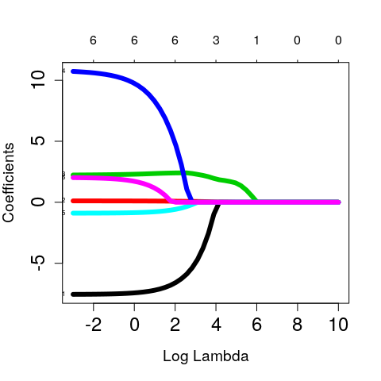
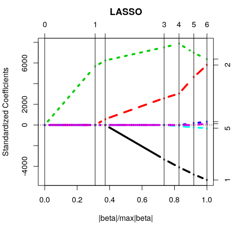
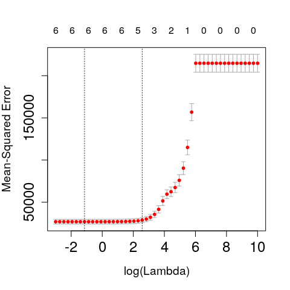
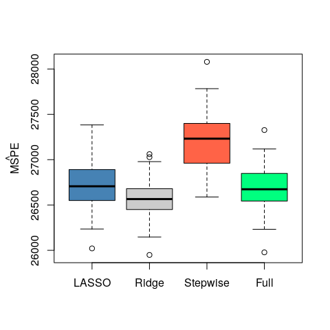
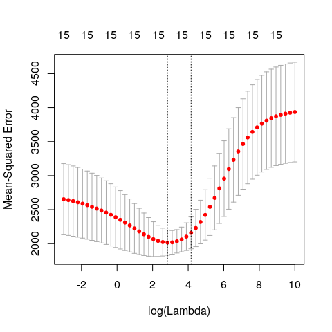
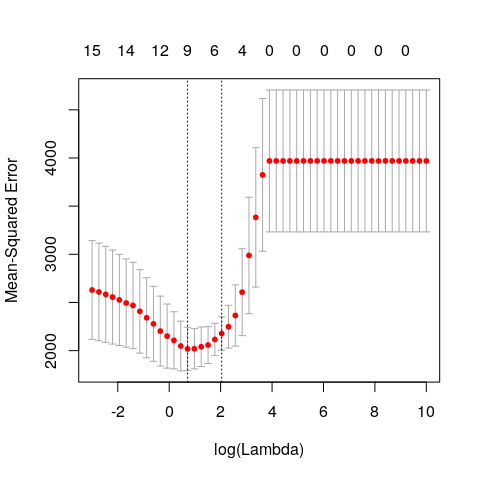
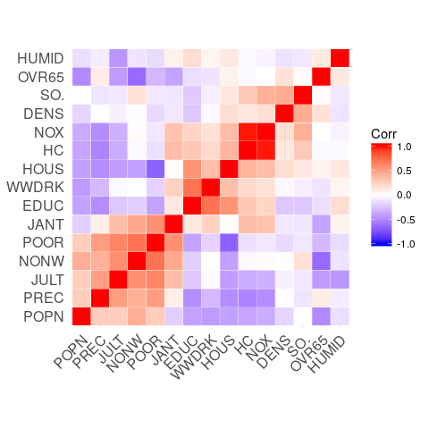
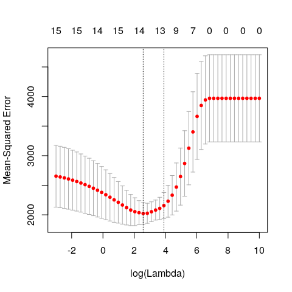
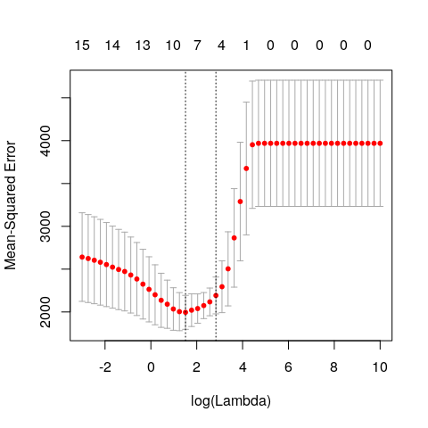
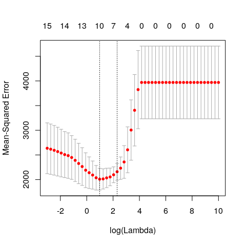

STAT406 - Lecture 7 notes
================
Matias Salibian-Barrera
2018-09-20

#### LICENSE

These notes are released under the "Creative Commons Attribution-ShareAlike 4.0 International" license. See the **human-readable version** [here](https://creativecommons.org/licenses/by-sa/4.0/) and the **real thing** [here](https://creativecommons.org/licenses/by-sa/4.0/legalcode).

Lecture slides
--------------

Preliminary lecture slides are [here](STAT406-18-lecture-7-preliminary.pdf).

LASSO
-----

A different approach to perform *some kind* of variable selection that may be more stable than stepwise methods is to use an L1 regularization term (instead of the L2 one used in ridge regression). Notwidthstanding the geometric "interpretation" of the effect of using an L1 penalty, it can also be argued that the L1 norm is, in some cases, a convex relaxation (envelope) of the "L0" norm (the number of non-zero elements). As a result, estimators based on the LASSO (L1-regularized regression) will typically have some of their entries equal to zero.

Just as it was the case for Ridge Regression, as the value of the penalty parameter increases, the solutions to the L1 regularized problem change from the usual least squares estimator (when the regularization parameter equals to zero) to a vector of all zeroes (when the penalty constant is sufficiently large). One difference between using an L1 or an L2 penalty is that for an L1-regularized problem, there usually is a finite value of the penalty term that produces a solution of all zeroes, whereas for the L2 penalizations this is not generally true.

The sequence of solutions changing by value of the penalty parameter is often used as a way to rank (or "sequence"") the explanatory variables, listing them in the order in which they "enter" (their estimated coefficient changes from zero to a non-zero value). <!-- Varying the value of the penalty term we obtain a path of solutions (much like --> <!-- we did in ridge regression), where the vector of estimated regression --> <!-- coefficients becomes sparser as the penalty gets stronger.  --> We can also estimate the MSPE of each solution (on a finite grid of values of the penalty parameter) to select one with good prediction properties. If any of the estimated regression coefficients in the selected solution are exactly zero it is commonly said that those explanatory variables are not included in the chosen model.

There are two main implementation of the LASSO in `R`, one is via the `glmnet` function (in package `glmnet`), and the other is with the function `lars` in package `lars`. Both, of course, compute the same estimators, but they do so in different ways.

We first compute the path of LASSO solutions for the `credit` data used in previous lectures:

``` r
x <- read.table('../Lecture5/Credit.csv', sep=',', header=TRUE, row.names=1)
# use non-factor variables
x <- x[, c(1:6, 11)]
y <- as.vector(x$Balance)
xm <- as.matrix(x[, -7])
library(glmnet)
# alpha = 1 - LASSO
lambdas <- exp( seq(-3, 10, length=50))
a <- glmnet(x=xm, y=y, lambda=rev(lambdas),
            family='gaussian', alpha=1, intercept=TRUE)
```

The `plot` method can be used to show the path of solutions, just as we did for ridge regression:

``` r
plot(a, xvar='lambda', label=TRUE, lwd=6, cex.axis=1.5, cex.lab=1.2)
```



Using `lars::lars()` we obtain:

``` r
library(lars)
b <- lars(x=xm, y=y, type='lasso', intercept=TRUE)
plot(b, lwd=4)
```



With `lars` the returned object is a matrix of regression estimators, one for each value of the penalty constant where a new coefficient "enters" the model:

``` r
# see the variables
coef(b)
```

    ##         Income      Limit   Rating     Cards        Age Education
    ## [1,]  0.000000 0.00000000 0.000000  0.000000  0.0000000  0.000000
    ## [2,]  0.000000 0.00000000 1.835963  0.000000  0.0000000  0.000000
    ## [3,]  0.000000 0.01226464 2.018929  0.000000  0.0000000  0.000000
    ## [4,] -4.703898 0.05638653 2.433088  0.000000  0.0000000  0.000000
    ## [5,] -5.802948 0.06600083 2.545810  0.000000 -0.3234748  0.000000
    ## [6,] -6.772905 0.10049065 2.257218  6.369873 -0.6349138  0.000000
    ## [7,] -7.558037 0.12585115 2.063101 11.591558 -0.8923978  1.998283

``` r
b
```

    ## 
    ## Call:
    ## lars(x = xm, y = y, type = "lasso", intercept = TRUE)
    ## R-squared: 0.878 
    ## Sequence of LASSO moves:
    ##      Rating Limit Income Age Cards Education
    ## Var       3     2      1   5     4         6
    ## Step      1     2      3   4     5         6

The presentation below exploits the fact that the LASSO regression estimators are piecewise linear between values of the regularization parameter where a variable enters or drops the model.

In order to select one LASSO estimator (among the infinitely many that are possible) we can use K-fold CV to estimate the MSPE of a few of them (for a grid of values of the penalty parameter, for example), and choose the one with smallest estimated MSPE:

``` r
# select one solution
set.seed(123)
tmp.la <- cv.lars(x=xm, y=y, intercept=TRUE, type='lasso', K=5,
                  index=seq(0, 1, length=20))
```


Given their random nature, it is always a good idea to run K-fold CV experiments more than once:

``` r
set.seed(23)
tmp.la <- cv.lars(x=xm, y=y, intercept=TRUE, type='lasso', K=5,
                  index=seq(0, 1, length=20))
```


We now repeat the same steps as above but using the implementation in `glmnet`:

``` r
# run 5-fold CV with glmnet()
set.seed(123)
tmp <- cv.glmnet(x=xm, y=y, lambda=lambdas, nfolds=5, alpha=1, 
                 family='gaussian', intercept=TRUE)
plot(tmp, lwd=6, cex.axis=1.5, cex.lab=1.2)
```


We ran CV again:

``` r
set.seed(23)
tmp <- cv.glmnet(x=xm, y=y, lambda=lambdas, nfolds=5, alpha=1, 
                 family='gaussian', intercept=TRUE)
plot(tmp, lwd=6, cex.axis=1.5, cex.lab=1.2)
```



Zoom in the CV plot to check the 1-SE rule:

``` r
plot(tmp, lwd=6, cex.axis=1.5, cex.lab=1.2, ylim=c(22000, 33000))
```


The returned object includes the "optimal" value of the penalization parameter, which can be used to find the corresponding estimates for the regression coefficients, using the method `coef`:

``` r
# optimal lambda
tmp$lambda.min
```

    ## [1] 0.3189066

``` r
# coefficients for the optimal lambda
coef(tmp, s=tmp$lambda.min)
```

    ## 7 x 1 sparse Matrix of class "dgCMatrix"
    ##                        1
    ## (Intercept) -480.5654477
    ## Income        -7.5153030
    ## Limit          0.1117195
    ## Rating         2.2638772
    ## Cards         10.4021961
    ## Age           -0.8801089
    ## Education      1.9363219

We can also use `coef` to compute the coefficients at any value of the penalty parameter. For example we show below the coefficients corresponding to penalty values of exp(4) and exp(4.5):

``` r
# coefficients for other values of lambda
coef(tmp, s=exp(4))
```

    ## 7 x 1 sparse Matrix of class "dgCMatrix"
    ##                         1
    ## (Intercept) -262.35053476
    ## Income        -0.63094341
    ## Limit          0.02749778
    ## Rating         1.91772580
    ## Cards          .         
    ## Age            .         
    ## Education      .

``` r
coef(tmp, s=exp(4.5)) # note no. of zeroes...
```

    ## 7 x 1 sparse Matrix of class "dgCMatrix"
    ##                         1
    ## (Intercept) -175.98151842
    ## Income         .         
    ## Limit          0.01492881
    ## Rating         1.76170516
    ## Cards          .         
    ## Age            .         
    ## Education      .

Compare MSPEs of Ridge & LASSO on the credit data
-------------------------------------------------

We now use 50 runs of 5-fold cross-validation to estimate (and compare) the MSPEs of the different estimators / predictors:

``` r
library(MASS)
n <- nrow(xm)
k <- 5
ii <- (1:n) %% k + 1
set.seed(123)
N <- 50
mspe.la <- mspe.st <- mspe.ri <- mspe.f <- rep(0, N)
for(i in 1:N) {
  ii <- sample(ii)
  pr.la <- pr.f <- pr.ri <- pr.st <- rep(0, n)
  for(j in 1:k) {
    tmp.ri <- cv.glmnet(x=xm[ii != j, ], y=y[ii != j], lambda=lambdas, 
                        nfolds=5, alpha=0, family='gaussian') 
    tmp.la <- cv.glmnet(x=xm[ii != j, ], y=y[ii != j], lambda=lambdas, 
                        nfolds=5, alpha=1, family='gaussian')
    null <- lm(Balance ~ 1, data=x[ii != j, ])
    full <- lm(Balance ~ ., data=x[ii != j, ])
    tmp.st <- stepAIC(null, scope=list(lower=null, upper=full), trace=0)
    pr.ri[ ii == j ] <- predict(tmp.ri, s='lambda.min', newx=xm[ii==j,])
    pr.la[ ii == j ] <- predict(tmp.la, s='lambda.min', newx=xm[ii==j,])
    pr.st[ ii == j ] <- predict(tmp.st, newdata=x[ii==j,])
    pr.f[ ii == j ] <- predict(full, newdata=x[ii==j,])
  }
  mspe.ri[i] <- mean( (x$Balance - pr.ri)^2 )
  mspe.la[i] <- mean( (x$Balance - pr.la)^2 )
  mspe.st[i] <- mean( (x$Balance - pr.st)^2 )
  mspe.f[i] <- mean( (x$Balance - pr.f)^2 )
}
boxplot(mspe.la, mspe.ri, mspe.st, mspe.f, names=c('LASSO','Ridge', 'Stepwise', 'Full'), col=c('steelblue', 'gray80', 'tomato', 'springgreen'), cex.axis=1, cex.lab=1, cex.main=2)
mtext(expression(hat(MSPE)), side=2, line=2.5)
```



We see that in this example LASSO does not seem to provide better predictions than Ridge Regression. However, it does yield a sequence of explanatory variables that can be interpreted as based on "importance" for the linear regression model (see above).

Comparing LASSO with Ridge Regression on the air pollution data
---------------------------------------------------------------

Let us compare the Ridge Regression and LASSO fits to the air pollution data. Of course, by *the Ridge Regression fit* and *the LASSO fit* we mean the fit obtained with the optimal value of the penalty constant chosen in terms of the corresponding estimated MSPE (which is in general estimated using K-fold cross validation).

We first load the data and use `cv.glmnet()` with `alpha = 0` to select an **approximately optimal** Ridge Regression fit (what makes the calculation below **only approximately** optimal?).

``` r
airp <- read.table('../Lecture1/rutgers-lib-30861_CSV-1.csv', header=TRUE, sep=',')
y <- as.vector(airp$MORT)
xm <- as.matrix(airp[, names(airp) != 'MORT'])
library(glmnet)
lambdas <- exp( seq(-3, 10, length=50))
# Ridge Regression
set.seed(23)
air.l2 <- cv.glmnet(x=xm, y=y, lambda=lambdas, nfolds=5, alpha=0, 
                 family='gaussian', intercept=TRUE)
plot(air.l2)
```



The plot above is included for illustration purposes only. Similarly, we now compute an approximately optimal LASSO fit, and look at the curve of estimated MSPEs:

``` r
# LASSO
set.seed(23)
air.l1 <- cv.glmnet(x=xm, y=y, lambda=lambdas, nfolds=5, alpha=1, 
                 family='gaussian', intercept=TRUE)
plot(air.l1)
```



It is interesting to compare the corresponding estimated regression coefficients, so we put them side by side in two columns:

``` r
cbind(round(coef(air.l2, s='lambda.min'), 3),
round(coef(air.l1, s='lambda.min'), 3))
```

    ## 16 x 2 sparse Matrix of class "dgCMatrix"
    ##                    1        1
    ## (Intercept) 1084.916 1100.355
    ## PREC           1.407    1.503
    ## JANT          -0.886   -1.189
    ## JULT          -0.836   -1.247
    ## OVR65         -2.000    .    
    ## POPN           5.977    .    
    ## EDUC          -8.154  -10.510
    ## HOUS          -1.156   -0.503
    ## DENS           0.005    0.004
    ## NONW           2.655    3.979
    ## WWDRK         -0.458   -0.002
    ## POOR           0.725    .    
    ## HC            -0.027    .    
    ## NOX            0.049    .    
    ## SO.            0.232    0.228
    ## HUMID          0.391    .

Note how several of them are relatively similar, but LASSO includes fewer of them. A possible explanation for this is the particular correlation structure among the explanatory variables. More specifically, when groups of correlated covariates are present, LASSO tends to choose only one of them, whereas Ridge Regression will tend to keep all of them. For a formal statement see Lemma 2 of

> Zou, H. and Hastie, T. (2005). Regularization and variable selection via the elastic net. *Journal of the Royal Statistical Society: Series B (Statistical Methodology)*, **67**(2), 301-320. [DOI: 10.1111/j.1467-9868.2005.00503.x](http://dx.doi.org/10.1111/j.1467-9868.2005.00503.x)

It is important to note here that the above observations regarding the Ridge Regression and LASSO fits trained on the air pollution data should be made on a more reliable (more stable, less variable) choice of penalty parameter. For example, we may want to run the above 5-fold CV experiments several times and take the average of the estimated optimal penalty parameters. To simplify the presentation we do not purse this here, but it may be a very good exercise for the reader to do so.

The following heatmap of the pairwise correlations among explanatory variables reveals certain patterns that may be used to explain the difference mentioned above. Note that in this visualization method variables were grouped ("clustered") according to their pairwise correlations in order to improve the interpretability of the plot. We will see later in this course the particular clustering method used here (hierarchical clustering).

``` r
library(ggcorrplot)
ggcorrplot(cor(xm), hc.order = TRUE, outline.col = "white")
```



<!-- # # https://briatte.github.io/ggcorr/ -->
<!-- # source('https://raw.githubusercontent.com/briatte/ggcorr/master/ggcorr.R') -->
<!-- # library(ggplot2) -->
<!-- #  -->
<!-- # ggcorr(xm) -->
<!-- # ggcorr(xm, nbreaks=3) -->
<!-- #  -->
<!-- # ggcorr(xm, geom = "blank", label = TRUE, hjust = 0.75) + -->
<!-- #   geom_point(size = 10, aes(color = coefficient > 0, alpha = abs(coefficient) > 0.5)) + -->
<!-- #   scale_alpha_manual(values = c("TRUE" = 0.25, "FALSE" = 0)) + -->
<!-- #   guides(color = FALSE, alpha = FALSE) -->
Compare MSPE of Ridge and LASSO on air pollution data
-----------------------------------------------------

Since our focus was on the properties of the resulting predictions, it may be interesting to compare the estimated MSPE of the different models / predictors we have considered so far: a full linear model, a model selected via stepwise + AIC, ridge regression and LASSO. As usual, we use 50 runs of 5-fold CV, and obtain the following boxplots:


We see that there is a marginal advantage of LASSO, but it is rather minor, and the three methods we have seen so far improve by similar margins on the predictions obtained by using a full linear regression model.

Less desirable properties of LASSO
----------------------------------

As important as the LASSO estimator has been, its properties may sometimes not be fully satisfactory. In particular:

-   The LASSO selects the right variables only under very restrictive conditions (in other words, it is generally not "variable selection"-consistent).
-   The LASSO sampling distribution is not the same as the one we would obtain with the standard least squares estimator if we knew which features to include and which ones to exclude from the model (in orther words, the LASSO does not have an "oracle" property).
-   When groups of correlated explanatory variables are present the LASSO tends to include only one variable (randomly) from the group, relegate the others to the end of the sequence.

For precise statements and theoretical results regarding the three points above, see

> Zou, H. (2006). The Adaptive Lasso and Its Oracle Properties. *Journal of the American Statistical Association*, **101**(476), 1418-1429. DOI: [10.1198/016214506000000735](http://doi.org/10.1198/016214506000000735)

and

> Zou, H. and Hastie, T. (2005). Regularization and variable selection via the elastic net. *Journal of the Royal Statistical Society: Series B (Statistical Methodology)*, **67**(2), 301-320. DOI: [10.1111/j.1467-9868.2005.00503.x](http://dx.doi.org/10.1111/j.1467-9868.2005.00503.x)

Elastic net
-----------

Elastic Net estimators were introduced to find an informative compromise between LASSO and Ridge Regression.

Note that `cv.glmnet` only considers fits with variying values of one of the penalty constants, while the other one (`alpha`) is kept fixed. To compare different Elastic Net fits we run `cv.glmnet` with 4 values of `alpha`: 0.05, 0.1, 0.5 and 0.75.

``` r
# EN
set.seed(23)
air.en.75 <- cv.glmnet(x=xm, y=y, lambda=lambdas, nfolds=5, alpha=0.75, 
                 family='gaussian', intercept=TRUE)
set.seed(23)
air.en.05 <- cv.glmnet(x=xm, y=y, lambda=lambdas, nfolds=5, alpha=0.05, 
                 family='gaussian', intercept=TRUE)
set.seed(23)
air.en.1 <- cv.glmnet(x=xm, y=y, lambda=lambdas, nfolds=5, alpha=0.1, 
                 family='gaussian', intercept=TRUE)
set.seed(23)
air.en.5 <- cv.glmnet(x=xm, y=y, lambda=lambdas, nfolds=5, alpha=0.5, 
                 family='gaussian', intercept=TRUE)
plot(air.en.05)
```



``` r
plot(air.en.5)
```



``` r
plot(air.en.75)
```



### Run EN on airpollution data, compare fits

We now compare the estimates of the regression coefficients obtained with the different methods discussed so far to alleviate potential problems caused by correlated covariates.

``` r
a <- cbind(round(coef(air.l2, s='lambda.min'), 3),
round(coef(air.l1, s='lambda.min'), 3), 
round(coef(air.en.05, s='lambda.min'), 3),
round(coef(air.en.1, s='lambda.min'), 3),
round(coef(air.en.5, s='lambda.min'), 3), 
round(coef(air.en.75, s='lambda.min'), 3))
colnames(a) <- c('Ridge', 'LASSO', 'EN-05', 'EN-10', 'EN-50', 'EN-75')
a
```

    ## 16 x 6 sparse Matrix of class "dgCMatrix"
    ##                Ridge    LASSO    EN-05    EN-10    EN-50    EN-75
    ## (Intercept) 1084.916 1100.355 1103.520 1097.110 1080.652 1099.067
    ## PREC           1.407    1.503    1.405    1.414    1.426    1.495
    ## JANT          -0.886   -1.189   -0.883   -0.905   -1.044   -1.153
    ## JULT          -0.836   -1.247   -0.795   -0.772   -0.854   -1.182
    ## OVR65         -2.000    .       -1.113   -0.211    .        .    
    ## POPN           5.977    .        0.073    .        .        .    
    ## EDUC          -8.154  -10.510   -8.359   -8.516   -9.918  -10.147
    ## HOUS          -1.156   -0.503   -1.137   -1.107   -0.636   -0.575
    ## DENS           0.005    0.004    0.005    0.005    0.004    0.004
    ## NONW           2.655    3.979    2.966    3.250    3.638    3.895
    ## WWDRK         -0.458   -0.002   -0.440   -0.400   -0.095   -0.052
    ## POOR           0.725    .        0.315    .        .        .    
    ## HC            -0.027    .       -0.006   -0.002    .        .    
    ## NOX            0.049    .        .        .        .        .    
    ## SO.            0.232    0.228    0.238    0.237    0.231    0.230
    ## HUMID          0.391    .        0.281    0.231    0.014    0.005

The same comment made above regarding the need of a more stable choice of "optimal" fits (for each of these methods) applies here. Again, here we limit ourselves to one run of 5-fold CV purely based on simplifying the presentation.

### Compare MSPE's of Full, LASSO, Ridge, EN and stepwise


We see that in this example Elastic Net with `alpha = 0.75` (which is not far from the LASSO) provides slightly better estimated MSPEs.

<!-- # Non-parametric regression -->
<!-- ## Polynomial regression -->
<!-- ```{r nonparam, fig.width=5, fig.height=5, message=FALSE, warning=FALSE} -->
<!-- # help(lidar, package='SemiPar') -->
<!-- data(lidar, package='SemiPar') -->
<!-- plot(logratio~range, data=lidar, pch=19, col='gray', cex=1.5) -->
<!-- # Degree 4 polynomials -->
<!-- pm <- lm(logratio ~ poly(range, 4), data=lidar) -->
<!-- plot(logratio~range, data=lidar, pch=19, col='gray', cex=1.5) -->
<!-- lines(predict(pm)[order(range)] ~ sort(range), data=lidar, lwd=4, col='blue') -->
<!-- # Degree 10 polynomials -->
<!-- pm2 <- lm(logratio ~ poly(range, 10), data=lidar) -->
<!-- lines(predict(pm2)[order(range)]~sort(range), data=lidar, lwd=4, col='red') -->
<!-- # A more flexible basis: splines -->
<!-- # linear splines ``by hand'' -->
<!-- # select the knots at 5 quantiles -->
<!-- kn <- as.numeric( quantile(lidar$range, (1:5)/6) ) -->
<!-- # prepare the matrix of covariates / explanatory variables -->
<!-- x <- matrix(0, dim(lidar)[1], length(kn)+1) -->
<!-- for(j in 1:length(kn)) { -->
<!--   x[,j] <- pmax(lidar$range-kn[j], 0) -->
<!-- } -->
<!-- x[, length(kn)+1] <- lidar$range -->
<!-- # Fit the regression model -->
<!-- ppm <- lm(lidar$logratio ~ x) -->
<!-- plot(logratio~range, data=lidar, pch=19, col='gray', cex=1.5) -->
<!-- lines(predict(ppm)[order(range)]~sort(range), data=lidar, lwd=4, col='green') -->
<!-- # a better way to obtain the same fit -->
<!-- library(splines) -->
<!-- ppm2 <- lm(logratio ~ bs(range, degree=1, knots=kn), data=lidar) -->
<!-- lines(predict(ppm)[order(range)]~sort(range), data=lidar, lwd=2, col='blue') -->
<!-- # quadratic splines? -->
<!-- plot(logratio~range, data=lidar, pch=19, col='gray', cex=1.5) -->
<!-- ppmq <- lm(logratio ~ bs(range, degree=2, knots=kn), data=lidar) -->
<!-- lines(predict(ppmq)[order(range)]~sort(range), data=lidar, lwd=4, col='steelblue') -->
<!-- # cubic splines -->
<!-- plot(logratio~range, data=lidar, pch=19, col='gray', cex=1.5) -->
<!-- ppmc <- lm(logratio ~ bs(range, degree=3, knots=kn), data=lidar) -->
<!-- lines(predict(ppmc)[order(range)]~sort(range), data=lidar, lwd=4, col='tomato3') -->
<!-- ``` -->
